### Running of the app

Install yarn
~~~
npm install --global yarn
~~~
Application is tested on node.js versions `v10.21.0` and `v15.2.1`

If `nvm` is installed, 

~~~
nvm use
~~~
can be used to set the version of node.js.

Additional details can be found in the section `Original document` - provided by `next.js'` tool which is used to generate the initial boilerplate code.

Docker might be used to provide DB support (or local instance should be set).
CONNECTION_STRING field of `.env` file should be updated accordingly.
Section `Postgres` describes how to run Pg in Docker.

Send grid integration is not tested on an actual account, nor email templates are used in the current implementation.

Integration with SalesForce is defined by .env file. The leads and campaigns requires an additional field.
Leads object need `amount:numeric(12:2)` field and Campaigns object requires `Project:numberic(8:0)` field.
The application relay on existence of manually created Campaigns. It's fine to use the existing test SF account. 

After db scheme is ready, execute db migration

~~~
yarn migrate:latest
~~~

and run the app in debug mode with (node.js debugging is enabled)

~~~
yarn dev
~~~

It might happen that application complains that the client side rendering and SSR side content doesn't match.
If this is the case, please, stop the application, remove `.next` folder (known caching issue) and restart the app.


### Application demonstrates:

- next.js React application (https://nextjs.org/)
- using of Material-UI (https://material-ui.com/)
- custom hooks
- state management based on MobX (https://mobx.js.org/README.html)
- form handling (https://react-hook-form.com/)
- basic usage of lodash library (https://lodash.com/)
- application configuration (https://www.npmjs.com/package/dotenv)
- basic integration with email delivery service (https://sendgrid.com/)
- integration with SalesForce/CRM (https://www.salesforce.com) 
- usage of logger (https://github.com/winstonjs/winston)
- SQL transaction management (http://knexjs.org/)
- code linting (https://eslint.org/, https://prettier.io/)
- private methods of the class (https://developer.mozilla.org/en-US/docs/Web/JavaScript/Reference/Classes/Private_class_fields)
- usage of Intl namespace used to provide i18n API (https://developer.mozilla.org/en-US/docs/Web/JavaScript/Reference/Global_Objects/Intl)
- testing hooks, mocking or modules, dealing with timers, testing of transient states of controls (async-await)
- e2e tests based on Nightwatch
- switching to Typescript

### Improvements

- generate missing Campaigns programmatically
- theme is not provided
- analytic (tracking) is missing
- integration with monitoring tool like Sentry, Bugsnag, ...
- accessibility
- flow flexibility (order of the pages depends on method defined in store - please check the comment in the code)
- add masked form for amount
- fraud prevention (captcha)


*Please note*: the original requirement was to provide a different flow:
- on submission, an info alert should be shown. The current implementation has additional "thanks" page.
The motivation was to check the implemented page transition validation.
If user try to open, for example, the second page directly, by directly providing of
the page URL to the address bar of the browser, the application will redirect to the 1st page.
The progress bar on the top was out of the scope too. 

*Note 2*: in order to demonstrate the transaction rollback, application currently doesn't support duplicated emails in SalesForce.
In general, the clients shouldn't be limited on a single investment, so for a demo purpose, the `unique email` constraint is not released in SalesForce.
Currently, 'returning customer' will be rejected (without no entries in db nor SF). The exposed EP `api/investment` looks like:

~~~
START TRANSACTION:
  WRITE TO DB
  ADD ITEM TO SalesForce
  SEND EMAIL
END
~~~

Failure of the `SEND EMAIL` is ignored as this step might be recovered (retry mechanism, Queue,...).
If `ADD ITEM TO SalesForce` fails, the transaction will be rolled back. Similar, if `WRITE TO DB` fails,
other 2 steps will be skipped.
 
*Why MobX*: this is my first time that `flux/redux/context` wasn't used (`redux` might be an overkill for this app - also skipped React context to give a try to another React's state management tool - based on Go4's observer pattern).

*Why react-hook-form*: this library is not based on the `render props` so on keystrokes there is 
no rerendering of the whole form.

### Application flow

The 1st step
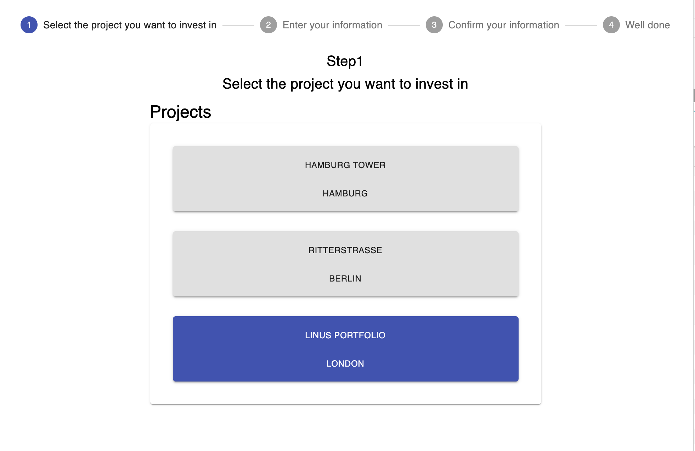

The 2nd step
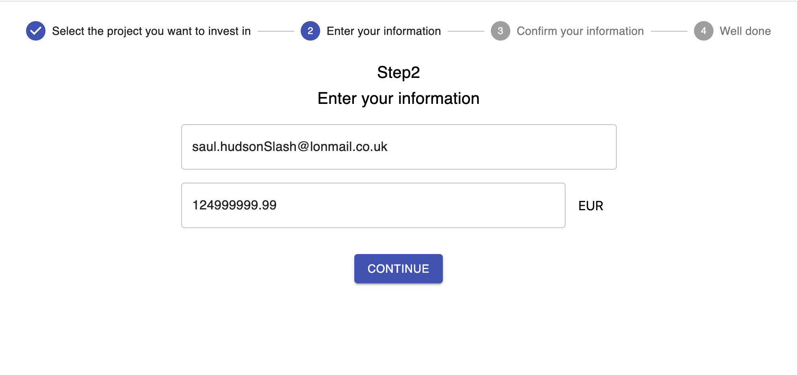

The 3rd step
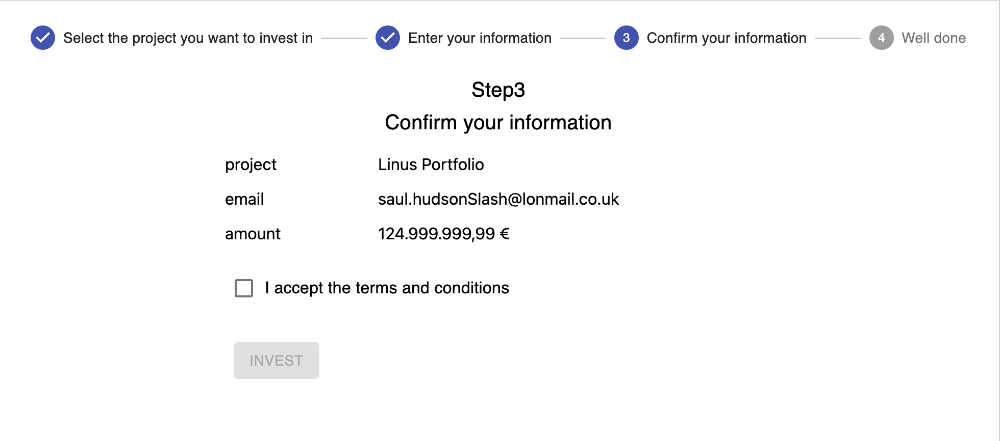

and failure on the form submission:
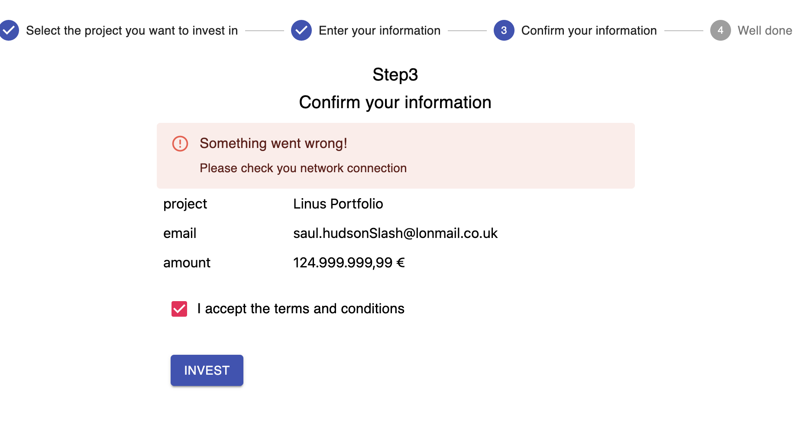

*Note*: in order to demonstrate API EP failure and usage alert, EP returns error each even time when is called.

### SalesForce

Leads created by application:
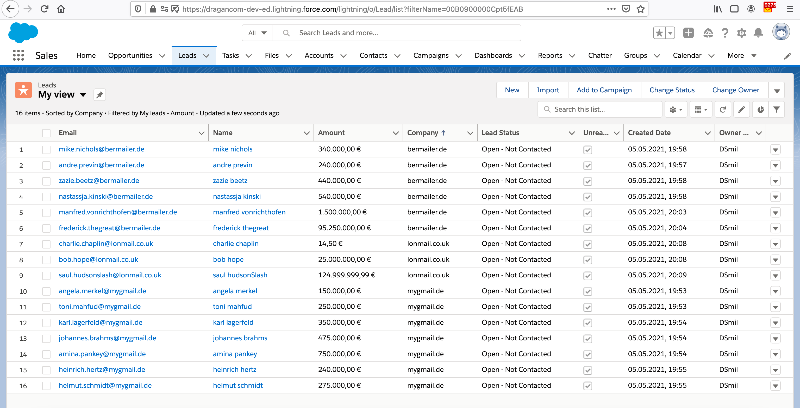
*Note* for the demo purpose, the first name, last name and organisation are extracted from email (if possible): 

~~~
(<?firstName>[^.]*)\.(?<lastName>[^@]*)@(<?company>.*)
~~~

Campaigns:
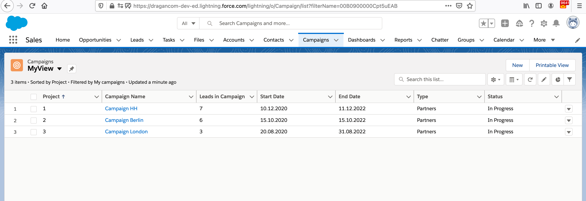

Leads associated to campaigns:
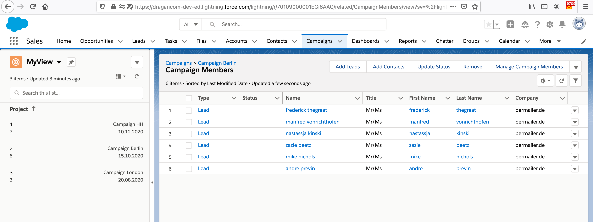

### Database content

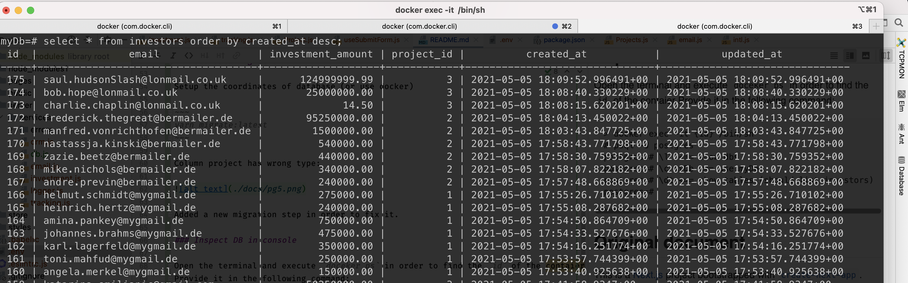

### useAlert hook

This hook provides a retriggerable mechanism to handle visibility of the alert box.
Whenever exposed function `setError():fn(boolean) -> void` is called with a truthy value
`isAlertShown:boolean` will hold value `true` for `VISIBLE_FOR_MS` ms. If `setError(true)`
is called while `isAlertShown=true`, the period while `isAlertShown` remains `true` will be
extended by additionally `VISIBLE_FOR_MS` ms.

### e2e

Execute 

~~~
yarn build
yarn start
# new console
yarn e2e
~~~

*Please note*: e2e test will likely fail if the application is run in debug mode as `watch` is running.

### Postgres 

Run the postgres in Docker and optionally install pgadmin (running it the browser):
~~~
docker run --name postgresql-container -p 5432:5432 -e POSTGRES_PASSWORD=admin -d postgres
# https://hub.docker.com/r/thajeztah/pgadmin4/
docker run --rm -p 5050:5050 thajeztah/pgadmin4
open http://0.0.0.0:5050/browser/
~~~

Check IP address of your PC (en0 as Wi-Fi was used in my case):

~~~
❯ ipconfig getifaddr en0
192.168.1.56
~~~

Click `Add New Server` in dashboard:

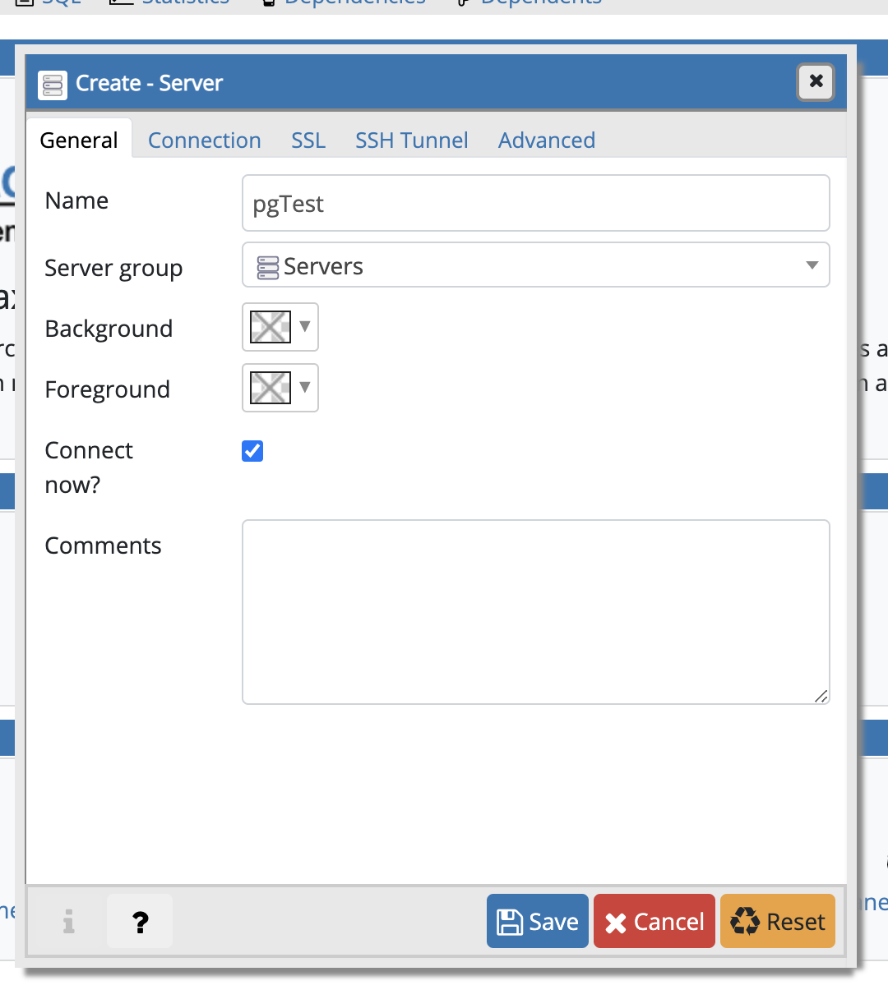

Replace localhost to your local IP. Enter `admin` for the password:

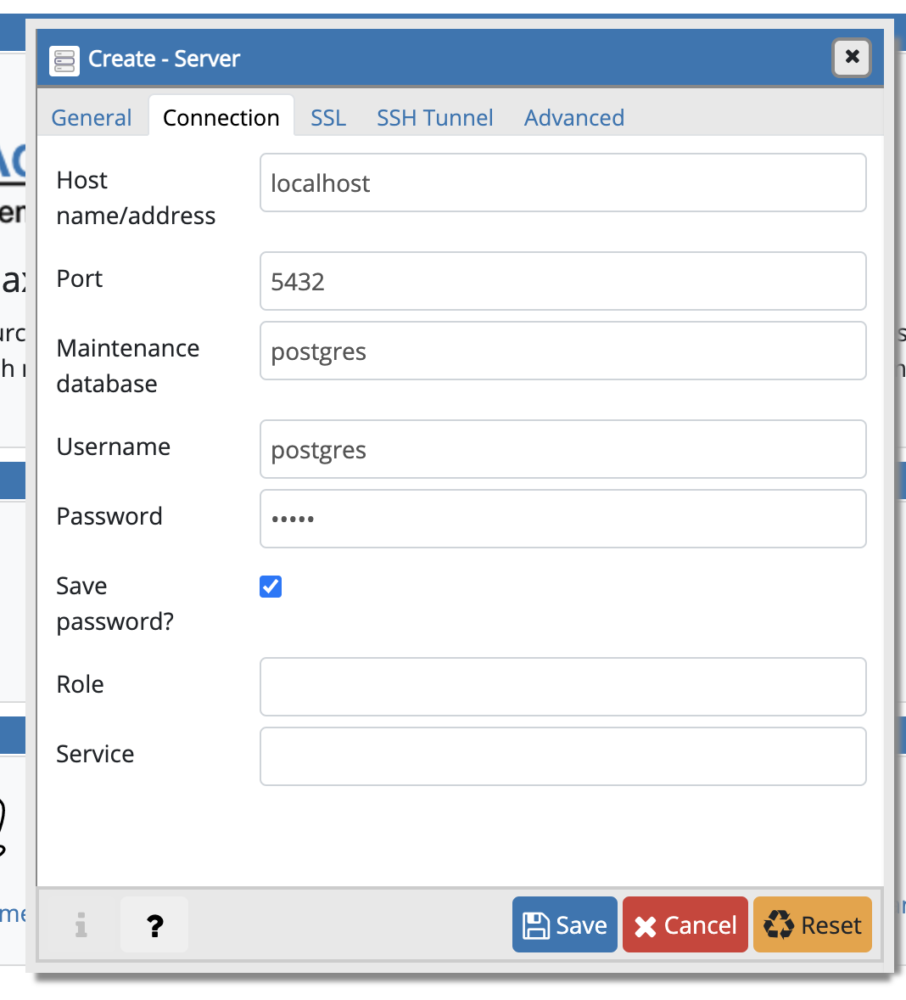
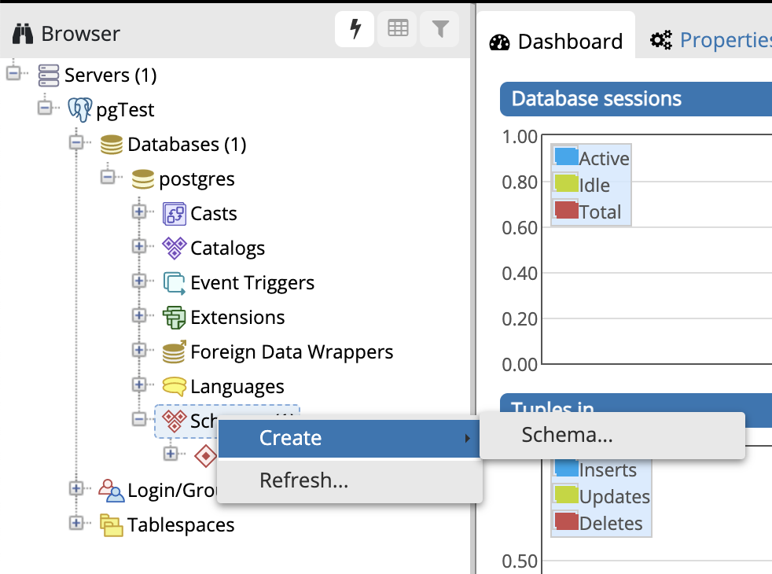

Right button at databases, pick `Create > Database...` and enter `myDb` in `General > Database` and press the Save button.

### Use data migration

Setup the "coordinates" of database (or use docker) in .env file and execute

~~~
yarn migrate:latest
~~~

in order to create the `investors` table.

### Inspect content of DB in console

Open the terminal and execute `doceker ps` in order to find the `id` of the `postgres`  container.
Replace {id} with actual `id` and execute:
~~~
> docker exec -it {id} /bin/sh
# psql -U postgres
postgres=# \l  <== show dbs
postgres=# \c myDb <== use myDb
myDb=# \dt <== show tables (should list investors)
myDb=# select * from investors order by created_at desc; <== show records
~~~

### Testing of API EP:

For testing purpose, you can use the following curl:
~~~
curl -X POST http://localhost:3000/api/investment
	 -H "Content-Type: application/json" 
     -d "{\"email\":\"dragan@net.com\",\"investment_amount\":\"123\",\"project_id\":\"123\"}"
~~~

### Test coverage

Please execute

~~~
yarn test --coverage
~~~

~~~
--------------------------|---------|----------|---------|---------|-------------------
File                      | % Stmts | % Branch | % Funcs | % Lines | Uncovered Line #s 
--------------------------|---------|----------|---------|---------|-------------------
All files                 |   95.14 |    88.89 |   88.46 |   94.85 |                   
 common                   |     100 |      100 |     100 |     100 |                   
  intl.ts                 |     100 |      100 |     100 |     100 |                   
  pagesConfig.ts          |     100 |      100 |     100 |     100 |                   
 components               |     100 |    88.89 |     100 |     100 |                   
  ConfirmInfo.tsx         |     100 |      100 |     100 |     100 |                   
  InvestorInformation.tsx |     100 |      100 |     100 |     100 |                   
  Layout.tsx              |     100 |      100 |     100 |     100 |                   
  Project.tsx             |     100 |       50 |     100 |     100 | 36                
  Projects.tsx            |     100 |    83.33 |     100 |     100 | 52                
 hooks                    |     100 |      100 |     100 |     100 |                   
  useAlert.ts             |     100 |      100 |     100 |     100 |                   
  useStore.ts             |     100 |      100 |     100 |     100 |                   
  useSubmitForm.ts        |     100 |      100 |     100 |     100 |                   
 store                    |   82.93 |       80 |    62.5 |    82.5 |                   
  investorData.ts         |     100 |      100 |     100 |     100 |                   
  navigation.ts           |   96.15 |       80 |    87.5 |      96 | 26                
  store.ts                |   45.45 |      100 |   16.67 |   45.45 | 38-55             
 test                     |     100 |      100 |     100 |     100 |                   
  TestWrapper.tsx         |     100 |      100 |     100 |     100 |                   
  mockFetch.ts            |     100 |      100 |     100 |     100 |                   
--------------------------|---------|----------|---------|---------|-------------------
~~~

### Dev notes
`yarn add --dev @types/jest` <== to get rid of warnings in Jest test files
`yarn add --dev typescript` <== add typescript modules
Fix ts interface issue:
https://stackoverflow.com/questions/55807329/why-eslint-throws-no-unused-vars-for-typescript-interface
    

-------------

## Original document

This is a [Next.js](https://nextjs.org/) project bootstrapped with [`create-next-app`](https://github.com/vercel/next.js/tree/canary/packages/create-next-app).

## Getting Started

First, run the development server:

```bash
npm run dev
# or
yarn dev
```

Open [http://localhost:3000](http://localhost:3000) with your browser to see the result.

You can start editing the page by modifying `pages/index.js`. The page auto-updates as you edit the file.

[API routes](https://nextjs.org/docs/api-routes/introduction) can be accessed on [http://localhost:3000/api/hello](http://localhost:3000/api/hello). This endpoint can be edited in `pages/api/hello.js`.

The `pages/api` directory is mapped to `/api/*`. Files in this directory are treated as [API routes](https://nextjs.org/docs/api-routes/introduction) instead of React pages.

## Learn More

To learn more about Next.js, take a look at the following resources:

- [Next.js Documentation](https://nextjs.org/docs) - learn about Next.js features and API.
- [Learn Next.js](https://nextjs.org/learn) - an interactive Next.js tutorial.

You can check out [the Next.js GitHub repository](https://github.com/vercel/next.js/) - your feedback and contributions are welcome!

## Deploy on Vercel

The easiest way to deploy your Next.js app is to use the [Vercel Platform](https://vercel.com/new?utm_medium=default-template&filter=next.js&utm_source=create-next-app&utm_campaign=create-next-app-readme) from the creators of Next.js.

Check out our [Next.js deployment documentation](https://nextjs.org/docs/deployment) for more details.
